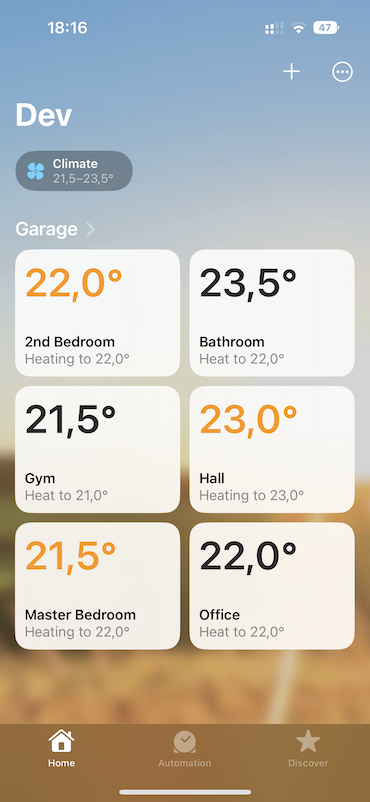

[](https://npmjs.org/package/@hernas/homebridge-salus-sq610)


# homebridge-salus-sq610
Salus SQ610/SQ610RF plugin for [HomeBridge](https://github.com/nfarina/homebridge) using the [Salus *Connect* API](https://eu.salusconnect.io/dashboard) to expose Salus Thermostats to Apple's HomeKit.



## Things to know
* Supports only one Salus account
* Plugin implements all modes of heating, but let's the thermostate decide if it is in cooling or heating mode. (for example by shorting S1 & S2 pins on the board)

## Getting started

### Sample configuration
```
{
  "platform": "SalusSQ610HomebridgePlugin",
  "email": "<YOUR_EMAIL_HERE>",
  "password": "<YOUR_PASSWORD_HERE>"
}
```

### Legal
* Licensed under [MIT](LICENSE)
* This is not an official plug-in and is not affiliated with Salus in any way
